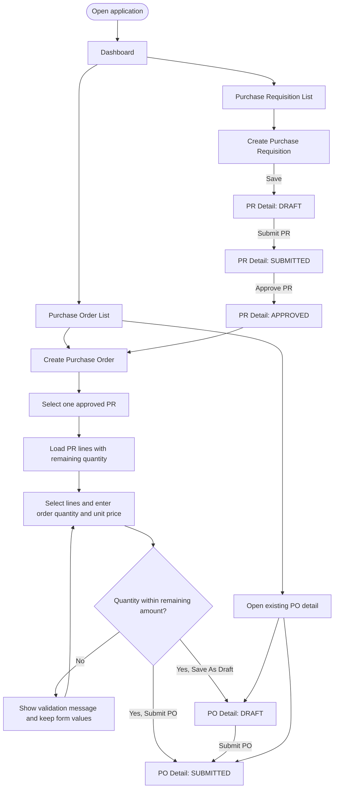
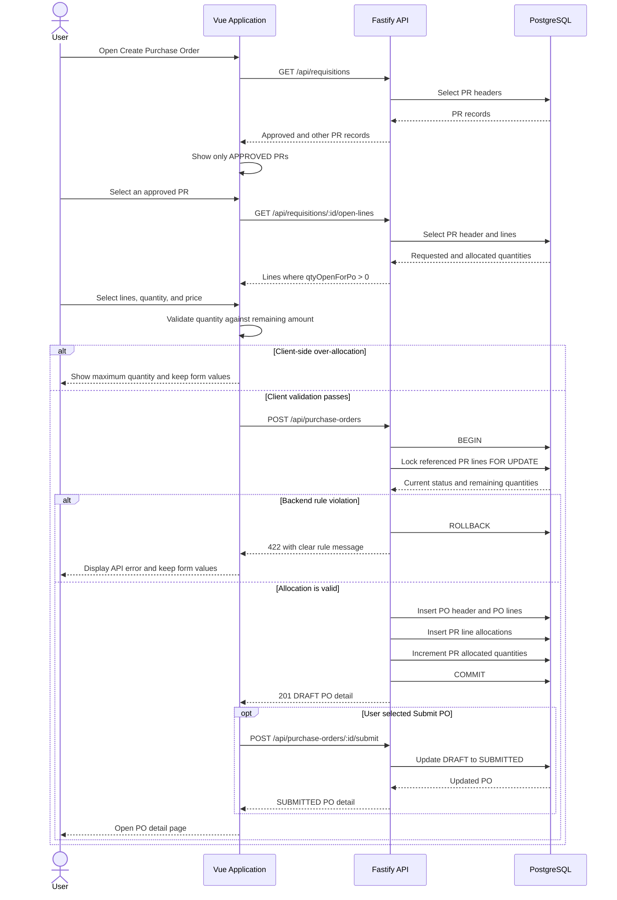

# Procurement MVP Application Guide

This document explains how the current application works from a user's perspective and how the frontend, backend, and database collaborate.

## Application Scope

The application currently supports:

- Purchase Requisition (PR) creation, submission, approval, listing, and detail.
- Purchase Order (PO) creation from approved PR lines, submission, listing, and detail.
- Allocation validation that prevents ordering more than the remaining PR quantity.
- Swagger API documentation and automated backend, frontend, and E2E tests.

Goods Receipt (GR) tables exist in the database, but the GR API and user interface are not implemented.

## Run the Application

Start PostgreSQL from the repository root:

```bash
docker compose up -d db
```

Install dependencies when running the project for the first time:

```bash
npm install
npm install --prefix backend
npm install --prefix frontend
```

Start the backend and frontend together:

```bash
npm run dev
```

Alternatively, run them in separate terminals:

```bash
npm run dev:backend
npm run dev:frontend
```

Available URLs:

| Service | URL |
| --- | --- |
| Web application | `http://localhost:5173` |
| Backend API | `http://localhost:3000` |
| Swagger UI | `http://localhost:3000/api-docs` |
| OpenAPI JSON | `http://localhost:3000/api-docs/json` |
| Health check | `http://localhost:3000/health` |

To reset the database to the supplied sample data:

```bash
docker compose down -v
docker compose up -d db
```

## Navigation

The top navigation provides three views:

| Navigation item | Route | Purpose |
| --- | --- | --- |
| Dashboard | `/` | Display PR totals and recent requisitions |
| Purchase Requisitions | `/requisitions` | List and manage PRs |
| Purchase Orders | `/purchase-orders` | List and manage POs |

## User Flow



## Purchase Requisition Workflow

PR status follows this sequence:

```text
DRAFT -> SUBMITTED -> APPROVED
```

### Create a PR

1. Open **Purchase Requisitions**.
2. Select **New PR**.
3. Enter requester, department, title, and optional header information.
4. Add one or more lines with item, quantity, UOM, price, and site information.
5. Select **Save As Draft**.
6. The application creates the PR and opens its detail page.

The API requires the requester, department, title, and at least one line. Requested quantity must be greater than zero and estimated unit price cannot be negative.

### Submit and Approve a PR

- A DRAFT PR detail page displays **Submit PR**.
- A SUBMITTED PR detail page displays **Approve PR**.
- An APPROVED PR is read-only and can provide lines for PO creation.
- Invalid status transitions return HTTP `422` and a clear message.

## Purchase Order Workflow

PO status follows this sequence:

```text
DRAFT -> SUBMITTED
```

### Create a PO

1. Open **Purchase Orders**.
2. Select **New PO**.
3. Enter the vendor.
4. Select one approved PR. DRAFT and SUBMITTED PRs are excluded.
5. The application loads PR lines where `qtyRequested - qtyAllocated > 0`.
6. Select one or more lines from that PR.
7. Enter an order quantity and unit price for each selected line.
8. Review the selected-line count and estimated total.
9. Select **Save As Draft** or **Submit PO**.

**Save As Draft** creates a DRAFT PO and opens its detail page. **Submit PO** creates the DRAFT PO, immediately submits it, and then opens the detail page with SUBMITTED status.

Fields shown from the source PR, such as item code, item name, UOM, site, and required date, are controlled by the backend. Unsupported Figma header and delivery fields remain visible but disabled so they do not imply that the API persists them.

### Allocation Rules

The frontend performs immediate validation, and the backend repeats the rules inside a database transaction:

- Vendor is required.
- At least one PR line must be selected.
- Order quantity must be finite and greater than zero.
- Unit price must be finite and zero or greater.
- Order quantity cannot exceed the PR line's remaining quantity.
- Every selected line must come from the same approved PR.
- A PR line cannot appear twice in one PO.

The backend locks each selected PR line using `SELECT ... FOR UPDATE`. This prevents concurrent PO requests from allocating the same remaining quantity.

### PO Detail

The detail page displays:

- PO number, vendor, status, and creation date.
- Ordered, received, and open quantities.
- Item, UOM, price, site, and required date.
- Source PR number and allocated quantity for each PO line.

A DRAFT PO displays **Submit PO**. A SUBMITTED PO has no further status action.

## Request Sequence



## API Summary

### Requisitions

| Method | Endpoint | Purpose |
| --- | --- | --- |
| `GET` | `/api/requisitions` | List PRs |
| `POST` | `/api/requisitions` | Create a DRAFT PR |
| `GET` | `/api/requisitions/:id` | Get PR detail |
| `POST` | `/api/requisitions/:id/submit` | Submit a DRAFT PR |
| `POST` | `/api/requisitions/:id/approve` | Approve a SUBMITTED PR |
| `GET` | `/api/requisitions/:id/open-lines` | Get lines available for PO allocation |

### Purchase Orders

| Method | Endpoint | Purpose |
| --- | --- | --- |
| `GET` | `/api/purchase-orders` | List POs |
| `POST` | `/api/purchase-orders` | Create a DRAFT PO and allocate PR quantities |
| `GET` | `/api/purchase-orders/:id` | Get PO detail and allocation sources |
| `POST` | `/api/purchase-orders/:id/submit` | Submit a DRAFT PO |
| `GET` | `/api/purchase-orders/:id/open-lines` | Get PO quantities available for future GR creation |

Successful creation returns HTTP `201`. Missing records return `404`. Business rule violations return `422` with a JSON response such as:

```json
{
  "message": "lines[0]: allocation qty 11 exceeds remaining 10"
}
```

## Tests and Artifacts

Run unit and component tests:

```bash
npm run test:unit
```

Run the PO E2E scenarios after PostgreSQL is available:

```bash
npm run test:e2e -- tests/e2e/po-module.spec.js
```

Playwright starts the backend and frontend automatically when they are not already running. The E2E suite covers PO creation/submission and over-allocation rejection.

Generated artifacts:

- HTML report: `playwright-report/index.html`
- Screenshots, traces, videos, and JSON results: `test-results/`

These generated directories are ignored by Git and should not be committed.

## Current Limitations

- GR APIs and pages are not implemented.
- Authentication and role-based access are not implemented.
- PR and PO numbers are generated from record counts and are not production-safe under concurrent creation.
- Swagger discovers the routes, but detailed request and response schemas are not defined for every endpoint.